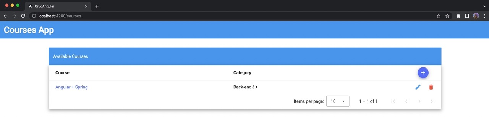
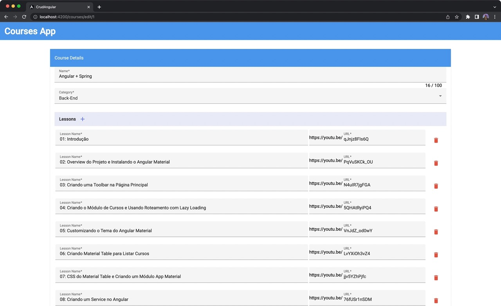
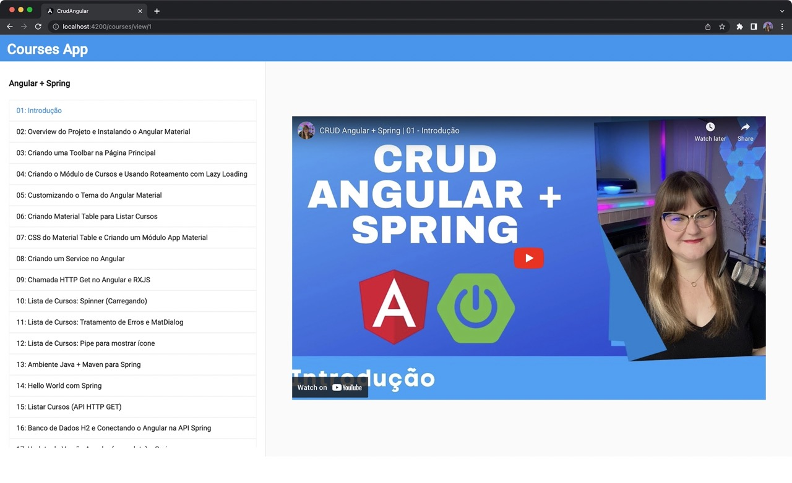

# Priming

- Java Extensions [link](https://marketplace.visualstudio.com/items?itemName=loiane.java-spring-extension-pack)
- Angular Extensions [link](https://marketplace.visualstudio.com/items?itemName=loiane.angular-extension-pack)

## Some functionalities available in the Front-end

- ✅ Angular Standalone components (Angular v16+)
- ✅ Angular Material components
- ✅ List of all courses with pagination
- ✅ Form to update/create courses with lessons (has-many - FormArray)
- ✅ View only screen
- ✅ TypedForms (Angular v14+)
- ✅ Presentational x Smart Components
- 🚧 Unit and Integration tests for components, services, pipes, guards

## Screenshots

Main Page with Pagination

<p align="center">
  
</p>

Form with One to Many (Course-Lessons)

<p align="center">
  
</p>

View Page with Youtube Player

<p align="center">
  
</p>

### Executing the front-end

You need to have Node.js / NPM installed locally.

1. Install all the required dependencies:

```
npm install
```

2. Execute the project:

```
npm run start
```

This command will run the Angular project with a proxy to the Java server, without requiring CORS.

Open your browser and access **http://localhost:4200** (Angular default port).

#### Upgrading Angular

```
ng update
```

Then

```
ng update @angular/cli @angular/core @angular/cdk @angular/material @angular/youtube-player --force
```
# priming_front_end_angular_material
